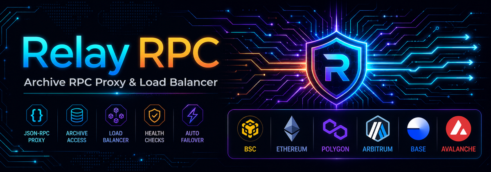
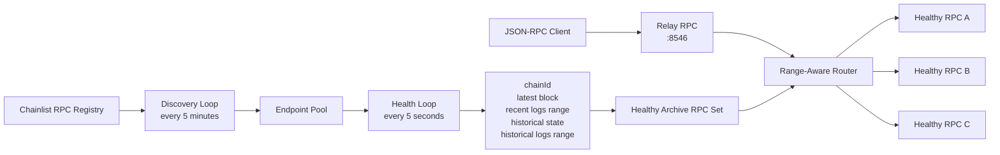
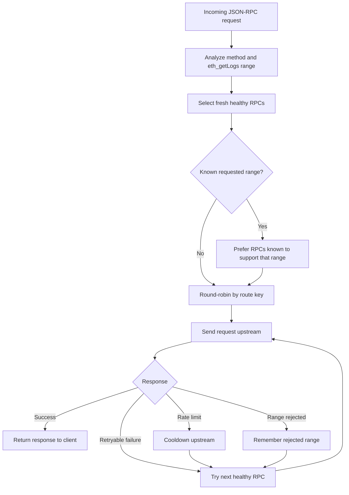
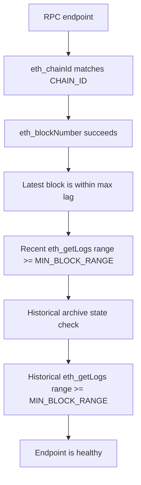

# Relay RPC

<p align="center">
  
</p>

Relay RPC is a Rust-based archive RPC proxy for EVM chains. It discovers public RPC endpoints from Chainlist, continuously filters them by archive capability and freshness, and routes JSON-RPC traffic across the healthy upstream pool.

It is designed for workloads that need both historical access and near-head realtime freshness.

## Features

- Rust HTTP service built with Tokio, Axum, and Reqwest.
- Chainlist-powered public RPC discovery.
- Optional `customrpclist.json` support for appending your own RPC endpoints.
- `.env` has only two required values: `CHAIN_ID` and `MIN_BLOCK_RANGE`.
- Rejects stale RPCs that are too far behind the freshest observed head.
- Requires `eth_getLogs` support above `10,000` blocks.
- Checks recent log ranges and historical archive access.
- Round-robin load balancing across healthy RPCs.
- Range-aware routing for large `eth_getLogs` requests.
- Automatic failover when an upstream rate-limits or rejects a range.
- Temporary cooldown for rate-limited upstreams.
- Docker and Docker Compose support.
- `/health` and `/rpcs` observability endpoints.

## Architecture



## Request Routing



## Health Model



## Project Structure

```text
.
├── Cargo.toml
├── Dockerfile
├── docker-compose.yml
├── assets
│   └── readme-banner.png
├── custom-rpc-list.sample.json
├── .env.example
├── README.md
└── src
    ├── main.rs              # Runtime bootstrap
    ├── chainlist.rs         # Chainlist endpoint discovery
    ├── config.rs            # .env parsing
    ├── health.rs            # Health and archive checks
    ├── request_analysis.rs  # JSON-RPC range analysis
    ├── router.rs            # Load balancing and failover
    ├── rpc.rs               # RPC transport helpers
    ├── server.rs            # HTTP routes and proxy endpoint
    ├── settings.rs          # Internal runtime constants
    ├── state.rs             # Endpoint pool state
    ├── types.rs             # Shared data types
    └── util.rs              # Small utilities
```

## Configuration

Create `.env`:

```env
CHAIN_ID=56
MIN_BLOCK_RANGE=10001
```

Only these two values are read from `.env`.

| Variable | Description |
|---|---|
| `CHAIN_ID` | EVM chain ID used to select the Chainlist RPC list. |
| `MIN_BLOCK_RANGE` | Minimum accepted `eth_getLogs` range. Must be greater than `10000`. |

### Custom RPC List

Relay RPC always reads Chainlist first. If a `customrpclist.json` file exists in the working directory, its `rpc` array is appended to the Chainlist endpoints before health checks begin.

Copy the example file:

```bash
cp custom-rpc-list.sample.json customrpclist.json
```

Example format:

```json
{
  "chainId": 56,
  "rpc": [
    "https://your-first-archive-rpc.example",
    {
      "url": "https://your-second-archive-rpc.example"
    }
  ]
}
```

Notes:

- `chainId` is optional. When present, it must match `CHAIN_ID`; otherwise the file is ignored.
- `rpc` accepts strings or Chainlist-style objects with a `url` field.
- Duplicate URLs are removed after Chainlist and custom endpoints are merged.
- `customrpclist.json` is ignored by git because it may contain private RPC keys.

Internal defaults:

| Setting | Value |
|---|---:|
| Port | `8546` |
| Chainlist refresh | `5 minutes` |
| Health interval | `5 seconds` |
| Max block lag | `15 blocks` |
| Max health age | `15 seconds` |
| Rate-limit cooldown | `30 seconds` |

## Run Locally

```bash
cargo run --release
```

Proxy URL:

```text
http://127.0.0.1:8546
```

Example request:

```bash
curl -s http://127.0.0.1:8546 \
  -H "content-type: application/json" \
  -d '{"jsonrpc":"2.0","id":1,"method":"eth_blockNumber","params":[]}'
```

Relay RPC adds these response headers:

```text
x-upstream-rpc: <selected upstream URL>
x-proxy-healthy-count: <current healthy upstream count>
```

## Run With Docker

Build:

```bash
docker build -t relay-rpc .
```

Run:

```bash
docker run --rm --env-file .env -p 8546:8546 relay-rpc
```

With a custom RPC list:

```bash
docker run --rm --env-file .env \
  -v "$PWD/customrpclist.json:/app/customrpclist.json:ro" \
  -p 8546:8546 relay-rpc
```

Or with Compose:

```bash
docker compose up --build
```

For Compose with a custom RPC list, create `customrpclist.json` first and uncomment the `volumes` block in `docker-compose.yml`.

## Observability

Health summary:

```bash
curl -s http://127.0.0.1:8546/health
```

Full endpoint state:

```bash
curl -s http://127.0.0.1:8546/rpcs
```

Example health response:

```json
{
  "ok": true,
  "healthyCount": 2,
  "totalCount": 51,
  "referenceLatestBlock": 95317841,
  "config": {
    "chainId": 56,
    "minBlockRange": 10001
  },
  "healthyRpcs": [
    {
      "url": "https://rpc.example",
      "lag": 2,
      "range": {
        "minSupported": 10001,
        "maxObserved": 10001,
        "rejectedAbove": null
      }
    }
  ]
}
```

## Notes

For BNB Smart Chain (`CHAIN_ID=56`), Relay RPC includes a strict historical archive probe against a known verified contract and block. For other chains, it still checks chain ID, freshness, recent log range, historical balance access, and historical log range. You can add strict chain-specific probes in `src/settings.rs`.
